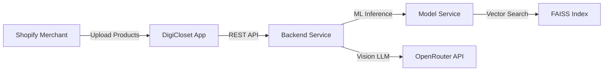
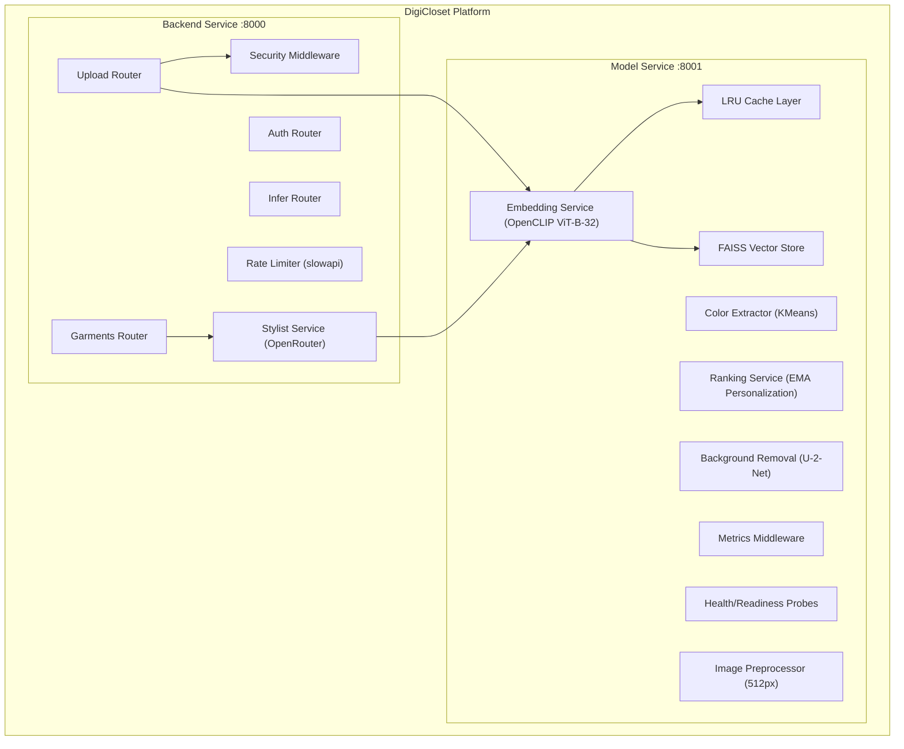
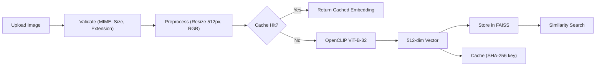
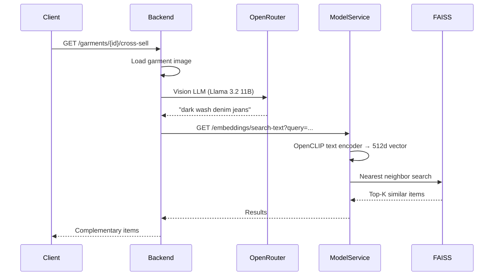

# DigiCloset Architecture (C4 Model)

## Context Diagram

## Container Diagram

## Component: ML Inference Pipeline

## Data Flow: Cross-Sell Recommendation

## Failure Modes & Recovery

| Failure | Impact | Recovery |
|---------|--------|----------|
| Model-service down | Uploads succeed but embeddings fail silently | Backend logs warning, retries on next access |
| FAISS index empty | Similar/cross-sell return empty results | Graceful empty response, no crash |
| OpenRouter rate-limited | Cross-sell returns fallback query | `stylist_service.py` catches exception, returns "black outfit accessory" |
| Oversized upload | Rejected at both backend (MIME) and model-service (10MB guard) | HTTP 400 with descriptive error |
| Cache full | Oldest entries evicted via LRU | Transparent to caller, slight latency increase |

## Security Layers

| Layer | Implementation | Location |
|-------|---------------|----------|
| CORS | Configurable origin allowlist | `backend/main.py` |
| Rate Limiting | slowapi (30 req/min upload, 10/min cross-sell, 5/min bg-removal) | `backend/main.py`, `garments.py` |
| SSRF Protection | Domain allowlist + private IP blocking | `security.py` |
| MIME Validation | Magic byte verification | `security.py` → `uploads.py` |
| Path Traversal | Regex sanitization of item IDs | `security.py` → `garments.py` |
| Input Sanitization | XSS character stripping middleware | `security.py` |
| Size Limits | 10MB at backend + model-service | `uploads.py`, `serve.py` |
